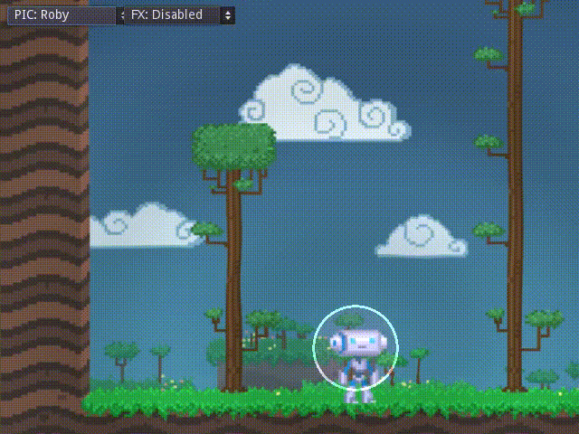

# Screen Space Shaders

my tests with the shader system of Godot

for now only a shader that mimics the time-dilation ring from Braid.

Language: [GDSL](https://docs.godotengine.org/en/latest/tutorials/shading/shading_reference/shading_language.html) and GDScript

Renderer: GLES 2

## Screenshots

